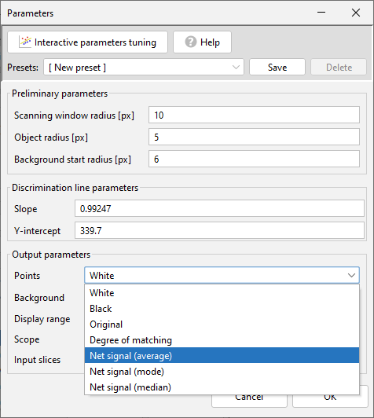

# Background Remover Help

Background Remover (BGR) is a plugin for the ImageJ platform that helps analyze fluorescence microscopy images with low signal-to-noise ratios and complex backgrounds.

BGR uses a special algorithm to separate signal from noise, preserving the real signal while removing background interference. This improves the detection of variable brightness objects in poor imaging conditions. BGR also provides accurate intensity measurements of detected objects, making it useful for researchers needing quantitative analysis.

## Installation and introductory information

To use the microscope image processing plugin for separating signal from noise, follow these steps:

1. Download the BackgroundRemover.jar file.
2. Place the downloaded file in the Plugins directory, which is located within the ImageJ or Fiji.app directory.
3. Restart the program.

After restarting, you will find the plugin easily accessible in the drop-down menu under **ImageJ: Plugins -> Background Remover**.

The file must be imported as either a single image or a stack. It is required that the image (or stack) is in 16-bit grayscale format. By default, the plugin is run for the active window.

 
Main window

The program offers two modes: automatic and manual. In automatic mode, you can either enter specific parameters into individual fields or load a previously saved set of parameters (referred to as a "Preset"). After clicking **OK** button, the program automatically searches for points and displays the resulting image in a new window. To switch to manual mode, click the **Interactive Parameters Tuning** button located in the upper left corner of the window.

 
Interactive parameters tuning button

The plugin adds annotations about the operations performed on the file, which can be viewed by selecting **Image -> Show Info...**.

 
Example of annotations

Please note that, due to the specific nature of ImageJ, annotations are displayed in a random order. They should be read in accordance with the numbering indicated in square brackets.

## Automatic mode

The automatic mode is easy to use and performs transformations based on user-provided parameters. These parameters can be entered manually or loaded from a file.

### Presets

To create a new preset, select the **[New preset]** option from the **Presets** drop-down list. After filling in all the required fields with the desired parameters, click the **Save** button. A new window will appear, prompting you to name the preset you are saving. Once you have chosen and confirmed a name, the newly created preset will appear in the preset drop-down list at the top of the window.

To access an existing preset, simply select it from the **Presets** drop-down list. You can update an existing preset and save the changes by clicking the **Save** button again. To load the most recently used preset, select **[Recently used]** from the drop-down list. If you wish to delete a preset, you can do so by clicking the **Delete** button.

 
Presets list

### Preliminary parameters

Preliminary parameters determine the size of the scanning window and the approximate size of objects in the image.

 
Preliminary parameters section

These parameters include:
- **Scanning window radius** - the size of the scanning window in pixels, specifically half the length of one side of the square;
- **Object radius** - the size of the object in pixels, measured as a radius;
- **Background start radius** - the distance from the analyzed pixel beyond which any pixels are considered part of the background. It is important to note that this distance should be greater than the  **Point radius**.

### Discrimination line parameters

To separate the signal from the noise, the program uses an appropriately adjusted discrimination line represented by the following equation:
$$
  y = a*x+b
$$

- **Slope** - slope coefficient of discrimination line(a);
- **Y-Intercept** - the point of intersection of the discrimination line with the OY axis (b).

 
Discrimination line parameters section

If these parameters are unknown, they should be established in manual mode.

### Output parameters

 
Output parameters section

**Points** - points display options available in the drop-down list:
  - **White** - points displayed in white;
  - **Black** - points displayed in black;
  - **Orginal** - points displayed as they appear in the original image;
  - **Degree of matching** - pixel intensity reflects the difference between the average intensity of the object area and the average intensity of the background area, a higher intensity indicates greater contrast against the background.
  - **Net signal (average)** - he pixel value is determined by subtracting the background, which is calculated as the arithmetic mean of the pixel values in the surrounding area of a detected object.
  - **Net signal (mode)** - the pixel value is determined by subtracting the background, which is calculated as the modal value of the pixel values in the surrounding area of a detected object;
  - **Net signal (median)** - the pixel value is determined by subtracting the background, which is calculated as the median of the pixel values in the surrounding area of a detected object.

 
Signal points types list

If one of the **Net signal** options is selected, two additional fields will appear for setting parameters:
- **Skip pixels** - the difference between the radius of the object for which the background is calculated and the inner radius of the ring used for background value determination (N);
- **Take pixels** - the difference between the outer and inner radius of the ring used to calculate the background (M).

 
Net signal parameters explanation

 
Net signal parameters

When one of the three versions of **Net signal** is selected, the **Output scale** option can also be chosen. Selecting **Original** preserves the original scale, while **Scaled** adjusts the pixel values to cover the entire display range, increasing the contrast of the image. However, it’s important to note that using the **Scaled** option can alter both the absolute and relative relationships between individual pixel values. Therefore, it is recommended to use this option mainly for visual purposes.

 
Comparison of scaled and nonscaled images. From left: nonscaled and scaled image.

- **Background** - available background display options:
  - **White** - background displayed in white;
  - **Black** - background displayed in black;
  - **Orginal** - the background displayed is identical to that in the original image;
  - **Degree of matching** - pixel intensity reflects the difference between the average intensity of the object area and the average intensity of the background area, a higher intensity indicates greater contrast against the background.

 
Background types list

Additional options:
- **Display range**: for the selected image (or stack), the display range can either remain unchanged (**Keep**) or be reset so that a pixel value of 0 corresponds to black (**Reset** ). This transformation will change the absolute pixel values ​​but retain their relative values. For example, if the basic display range is 1746.0 - 15951.0, where 1746.0 corresponds to the darkest pixel in the image (black), and 15951.0 corresponds to the brightest pixel (white), then after the transformation, the pixels will take values ​​in the range 0 - 14205.0. The value of each pixel in each of the images in the stack has been reduced by 1746.0, and now black pixels have a value of 0, while white pixels have a value of 14205.0.
- **Scope**: choose whether the plugin should perform operations solely on the selected image (**Current slice**) or on all images in the stack in the active window (**All slices**).
- **Input slices**: this feature provides the option to select between a stack of processed images (**Omit**) or a stack where the resulting images are interleaved with the corresponding original images (**Include**). It is beneficial, for instance, when comparing resulting and original images or when creating masks.

## Manual mode
In manual mode, you can optimize both the input parameters and, most importantly, the parameters of the discrimination line. Manual mode operates on the currently active image or the active image in a stack. To switch to manual mode, click the "**Interactive Parameters Tuning**" button located in the upper right corner of the window.

 
Interactive parameters mode button

After pressing this button, the plugin automatically enters manual mode and opens two additional windows: **Preview** and **Discrimination plot**.

 
Manual mode - main window

In the manual mode window, you will see that the "**Interactive Parameters Tuning**" button has been replaced by the "**Profile plot window**" button. This new button opens an additional window that displays profiles for individual pixels. Additionally, in the **Discrimination line parameters** section, there are new options related to curve fitting, including an **Auto fitting** feature.

 
Preview window

The **Preview** window displays two stacked images. The first image presents a preview of the predicted result, while the second image shows the original input image. This setup enables a real-time comparison between the input and output images.

The **Discrimination Plot** window initially features only a chart template, which is used to define the parameters for the discrimination line.

 
Empty plot window

### Algorithm for setting line and preliminary parameters

1. Determining the initial parameters.
2. Marking background areas.
3. Marking of signal points.
4. Establishing discrimination line parameters.
5. Determining the output parameters.

#### Determining the initial parameters

In the main **Parameters** window, input the initial conditions under **Preliminary parameters**:

- **Scanning window radius** - the size of the scanning window in pixels, specifically half the length of one side of the square. Ideally, this window should be sized to ensure that there is no more than one signal object present at a time, surrounded by a comparable amount of background. It is important to note that a smaller scanning window will result in a shorter operating time for the plugin.
- **Point radius** -  the size of the point, measured in pixels (radius). If the objects are of comparable size, enter their averaged radius in pixels. If the objects are different sizes, use the radius of the smallest one. If there is a significant difference between the horizontal and vertical sizes of the objects, provide the measurement of the smaller dimension. Additionally, the specified radius must be smaller than the **Scanning Window Radius**.
- **Background start radius** - the distance from the analyzed pixel beyond which pixels are considered background. This distance must be greater than the **Point radius** and smaller than the **Scanning window radius**.

#### Marking background areas

Select the areas in the image that you consider to be part of the background. Be sure not to include any parts related to the signal you want to isolate. It's best to choose areas with a variety of intensities, particularly those close to the signal.

The default selection tool in ImageJ for choosing background areas is the oval tool. However, you can switch to other selection tools, such as the rectangle, polygon, or freehand selections. You can use different tools for different areas of the image. To select multiple areas, simply hold down the **SHIFT** key while making your selections. You can move a previously selected area using the mouse, and to delete any selected background areas, use the right **ALT** key. Additionally, you can access the tools from **Edit -> Selection**.

In the **Preview** window, you can select the background in both the original image and the preview image.

 
Sample image with the selected background

The chosen background points will be displayed on the plot in **Discrimination plot** window as blue circles.

 
Background pixels plotted on the graph (blue points)

 
Background pixels selected in the image transferred to the chart

#### Marking of signal points

To switch from background selection mode to point selection mode, click the **Points Selection** button in the **Preview** window. When you do this, any selected background areas will disappear. To return to background selection mode, simply click the **Background Selection** button. 

You can select points using the **Multi-Point** tool in ImageJ. After marking the points, you can move them using your mouse. To delete a selected point, hold down the left or right **ALT** key while clicking on it. Similar to background selection, points can be selected in both the original image and the preview.

 
Sample image with the selected signal pixels

The graph in **Discrimination plot** window will show red circles that correspond to the selected points in the image. The numbers on the image will match those on the chart, allowing for any necessary adjustments.

 
Signal pixels plotted on the graph (red points)

To accurately define object boundaries, it is advisable to mark pixels near the object's edge.

 
Example of marking a point on the boundary of an object

#### Establishing discrimination line parameters

After selecting both the background and the signal in the **Preview** window, you can view the corresponding points on the graph. These points can be used to draw a discrimination line, which is represented by a yellow line on the chart. You can adjust the position and slope of the curve using your mouse. Alternatively, you can enter specific numerical values for the line's parameters in the **Parameters** window. The equation of a straight line is:

$$
  y = a*x+b
$$

- **Slope** - slope coefficient of discrimination line(a);
- **Y-Intercept** - the point of intersection of the discrimination line with the OY axis (b).

The second method is especially useful when a specific slope is needed for the adjusted discrimination line.

The third option is to use one of the three buttons in the **Preview** window in the **Discrimination line** section:
- **Below points** - the line is fitted so that it is just below the lowest signal points marked on the chart;
- **Middle** - the line is adjusted in the middle of the distance between the highest marked points of the background and the lowest marked points of the signal;
-**Above noise** -  the line is fitted just above the highest selected noise points.

The slope coefficient of the discrimination line can be fixed by checking the **Fix slope** checkbox.

To enable automatic adjustment of discrimination line parameters, a minimum of 5 signal points and 10 noise points must be marked on the graph. Additionally, the signal and noise points should be in similar **Mean surrounding intensity**. If the discrimination line cannot be automatically adjusted, the plugin will display an appropriate message.

 
Discrimination line fitted using <b>Below points</b> button
 

 
Discrimination line fitted using <b>Middle</b> button
 

 
Discrimination line fitted using <b>Above noise</b> button

#### Determining the output parameters

The final stage involves determining the output parameters, specifically how signal points and background are represented in the output image. Here are examples of various options for displaying the same resulting image. It's important to note that not all methods allow for the preservation of the nominal signal intensity.

 
White points on black background preview
 

 
Black points on white background preview
 

 
The original intensity of signal points on the black background preview
 

 
Intensity of points showing the degree of matching of signal points on black background preview
 

 
Net signal of points (using median) on black background preview
 

### Pixels surrounding intensity profile window

In manual mode, you can view histograms for individual signals and background pixels that are marked on the graph. To access this feature, click the **Profile Plot Window** button located in the upper left corner of the **Parameters** window. A new **Pixels surrounding intensity profile** window will open, displaying the profiles of selected signal pixels in red (up to a maximum of 10) and the background profiles in blue (also up to 10 pixels). A light blue vertical line indicates the point from which the pixel's surroundings are measured. The maximum value on the X-axis represents the size of the scanning window.

For detailed information on how these profiles are calculated, please refer to the publication.

 
Example of Pixel surrounding intensity profile window

